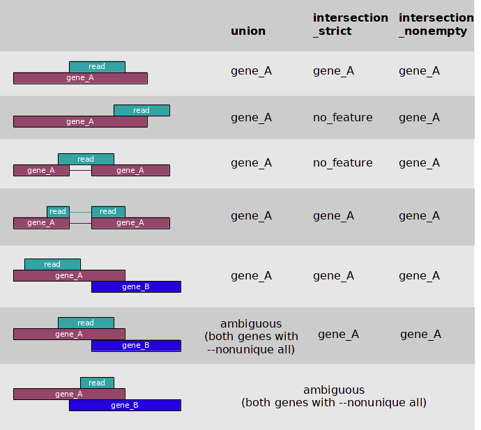

.. _count:

.. program:: htseq-count

***********************************************
Counting reads in features with ``htseq-count``
***********************************************

Given a file with aligned sequencing reads and a list of genomic
features, a common task is to count how many reads map to each feature.

A feature is here an interval (i.e., a range of positions) on a chromosome
or a union of such intervals.

In the case of RNA-Seq, the features are typically genes, where each gene
is considered here as the union of all its exons. One may also consider
each exon as a feature, e.g., in order to check for alternative splicing.
For comparative ChIP-Seq, the features might be binding region from a 
pre-determined list.

Special care must be taken to decide how to deal with reads that align to or
overlap with more than one feature. The ``htseq-count`` script allows to
choose between three modes. Of course, if none of these fits your needs,
you can write your own script with HTSeq. See the chapter :ref:`tour` for a
step-by-step guide on how to do so. See also the FAQ at the end, if the
following explanation seems too technical.

The three overlap resolution modes of ``htseq-count`` work as follows. For 
each position `i` in the read, a set `S(i)` is defined as the set of all 
features overlapping position `i`. Then, consider the set `S`, which is 
(with `i` running through all position within the read or a read pair)

* the union of all the sets `S(i)` for mode ``union``. This mode is recommended for most use cases.

* the intersection of all the sets `S(i)` for mode ``intersection-strict``.

* the intersection of all non-empty sets `S(i)` for mode ``intersection-nonempty``.

If `S` contains precisely one feature, the read (or read pair) is counted for this feature. If
`S` is empty, the read (or read pair) is counted as ``no_feature``. If `S`
contains more than one feature, ``htseq-count`` behaves differently based on
the ``--nonunique`` option:

* ``--nonunique none`` (default): the read (or read pair) is counted as
  ``ambiguous`` and not counted for any features. Also, if the read (or read
  pair) aligns to more than one location in the reference, it is scored as
  ``alignment_not_unique``.

* ``--nonunique all``: the read (or read pair) is counted as ``ambiguous``
  and is also counted in all features to which it was assigned. Also, if the
  read (or read pair) aligns to more than one location in the reference, it is
  scored as ``alignment_not_unique`` and also separately for each location.

* ``--nonunique fraction``: the read (or read pair) is counted as ``ambiguous``
  and is also counted fractionally in all features to which it was assigned. For 
  example, if the read overlaps with 3 features, it will be counted 1/3 to each of them.

* ``--nonunique random``: the read (or read pair) is counted as ``ambiguous``
  and is also counted uniformly at random to ``one of`` the features to which it was 
  assigned.

Notice that when using ``--nonunique all`` the sum of all counts will not
be equal to the number of reads (or read pairs), because those with multiple
alignments or overlaps get scored multiple times. By contrast, with 
``--nonunique fraction`` or ``--nonunique random``, the sum of all counts 
will be equal to the number of reads (or read pairs).

The following figure illustrates the effect of these three modes and the
``--nonunique`` option:

Usage
-----

After you have installed HTSeq (see :ref:`install`), you can run ``htseq-count`` from
the command line::

   htseq-count [options] <alignment_files> <gff_file>
   
If the file ``htseq-count`` is not in your path, you can, alternatively, call the script with

::
   
   python -m HTSeq.scripts.count [options] <alignment_files> <gff_file>
   
The ``<alignment_files>`` are one or more files containing the aligned reads in SAM format.
(SAMtools_ contain Perl scripts to convert most alignment formats to SAM.)
Make sure to use a splicing-aware aligner such as STAR_. HTSeq-count makes 
full use of the information in the CIGAR field.

To read from standard input, use ``-`` as ``<alignment_files>``.

If you have paired-end data, pay attention to the ``-r`` option described below.
         
.. _SAMtools: http://www.htslib.org/
.. _STAR: https://github.com/alexdobin/STAR

The ``<gff_file>`` contains the features in the `GFF format`_.

.. _`GFF format`: http://www.sanger.ac.uk/resources/software/gff/spec.html

The script outputs a table with counts for each feature, followed by
the special counters, which count reads that were not counted for any feature
for various reasons. The names of the special counters all start with 
a double underscore, to facilitate filtering. (Note: The double unscore
was absent up to version 0.5.4). The special counters are:

* ``__no_feature``: reads (or read pairs) which could not be assigned to any feature 
  (set `S` as described above was empty).
   
* ``__ambiguous``: reads (or read pairs) which could have been assigned to more than 
  one feature and hence were not counted for any of these, unless the
  ``--nonunique all`` option was used (set `S` had more than one element).
  
* ``__too_low_aQual``: reads (or read pairs) which were skipped due to the ``-a``
  option, see below
  
* ``__not_aligned``: reads (or read pairs) in the SAM file without alignment

* ``__alignment_not_unique``: reads (or read pairs) with more than one reported alignment.
  These reads are recognized from the ``NH`` optional SAM field tag. 
  (If the aligner does not set this field, multiply aligned reads will 
  be counted multiple times, unless they getv filtered out by due to the ``-a`` option.)
  Note that if the ``--nonunique all`` option was used, these reads (or read pairs)
  are still assigned to features.

*Important:* The default for strandedness is *yes*. If your RNA-Seq data has not been made
with a strand-specific protocol, this causes half of the reads to be lost.
Hence, make sure to set the option ``--stranded=no`` unless you have strand-specific
data!
  
      
Options
.......

.. cmdoption::  -f <format>, --format=<format>  

   Format of the input data. Possible values are ``sam`` (for text SAM files)
   and ``bam`` (for binary BAM files). Default is ``sam``.

   DEPRECATED: Modern versions of samtools/htslibs, which HTSeq uses to access
   SAM/BAM/CRAM files, have automatic file type detection. This flag will be
   removed in future versions of htseq-count.

.. cmdoption::  -r <order>, --order=<order>

  For paired-end data, the alignment have to be sorted either by read name or
  by alignment position. If your data is not sorted, use the ``samtools sort``
  function of ``samtools`` to sort it. Use this option, with ``name`` or ``pos`` 
  for ``<order>`` to indicate how the input data has been sorted. The default 
  is ``name``.

  If ``name`` is indicated, ``htseq-count`` expects all the alignments for the
  reads of a given read pair to appear in adjacent records in the input data.
  For ``pos``, this is not expected; rather, read alignments whose mate alignment
  have not yet been seen are kept in a buffer in memory until the mate is found.
  While, strictly speaking, the latter will also work with unsorted data, sorting
  ensures that most alignment mates appear close to each other in the data 
  and hence the  buffer is much less likely to overflow.

.. cmdoption::  --max-reads-in-buffer=<number>

  When <alignment_file> is paired end sorted by position, allow only so many
  reads to stay in memory until the mates are found (raising this number will use
  more memory). Has no effect for single end or paired end sorted by name.
  (default: ``30000000``)

.. cmdoption:: -s <yes/no/reverse>, --stranded=<yes/no/reverse>

   Whether the data is from a strand-specific assay (default: ``yes``)
   
   For ``stranded=no``, a read is considered overlapping with a feature regardless
   of whether it is mapped to the same or the opposite strand as the feature.
   For ``stranded=yes`` and single-end reads, the read has to be mapped to the same
   strand as the feature. For paired-end reads, the first
   read has to be on the same strand and the second read on the opposite strand.
   For ``stranded=reverse``, these rules are reversed.

.. cmdoption:: -a <minaqual>, --a=<minaqual>

   Skip all reads with MAPQ alignment quality lower than the given
   minimum value (default: 10). MAPQ is the 5th column of a SAM/BAM
   file and its usage depends on the software used to map the reads.

.. cmdoption:: -t <feature type>, --type=<feature type>

   Feature type (3rd column in GTF file) to be used, all
   features of other type are ignored (default, suitable
   for RNA-Seq analysis using an `Ensembl GTF`_ file: ``exon``)
   
.. _`Ensembl GTF`: http://mblab.wustl.edu/GTF22.html

.. cmdoption:: -i <id attribute>, --idattr=<id attribute>

   GTF attribute to be used as feature ID. Several GTF lines with the same
   feature ID will be considered as parts of the same feature. The feature ID
   is used to identity the counts in the output table. The default, suitable 
   for RNA-Seq analysis using an Ensembl GTF file, is ``gene_id``. 

.. cmdoption:: --additional-attr=<id attributes>

   Additional feature attributes, which will be printed as an additional column
   after the primary attribute column but before the counts column(s). The
   default is none, a suitable value to get gene names using an Ensembl GTF
   file is ``gene_name``. To use more than one additional attribute, repeat
   the option in the command line more than once, with a single attribute each
   time, e.g. ``--additional-attr=gene_name --additional_attr=exon_number``.

.. cmdoption::  -m <mode>, --mode=<mode>  

   Mode to handle reads overlapping more than one feature. Possible values for
   `<mode>` are ``union``, ``intersection-strict`` and ``intersection-nonempty``
   (default: ``union``)

.. cmdoption:: --nonunique=<nonunique mode>

   Mode to handle reads that align to or are assigned to more than one feature
   in the overlap `<mode>` of choice (see -m option). `<nonunique mode>` are
   ``none`` and ``all`` (default: ``none``)

.. cmdoption:: --secondary-alignments=<mode>

   Mode to handle secondary alignments (SAM flag 0x100). `<mode>` can be
   ``score`` and ``ignore`` (default: ``score``)

.. cmdoption:: --supplementary-alignments=<mode>

   Mode to handle supplementary/chimeric alignments (SAM flag 0x800). `<mode>`
   can be ``score`` and ``ignore`` (default: ``score``)

.. cmdoption:: -o <samout>, --samout=<samout>

   Write out all SAM alignment records into SAM files (one per input file
   needed), annotating each line with its feature assignment (as an optional
   field with tag 'XF')

.. cmdoption:: -p <samout_format>, --samout-format=<samout_format>

   Format to use with the --samout option, can be ``bam`` or ``sam``
   (default: ``sam``).
   
.. cmdoption:: -q, --quiet           
   
   Suppress progress report and warnings

.. cmdoption:: -h, --help

   Show a usage summary and exit  

.. cmdoption:: --version

   Show software version and exit  

Frequenctly asked questions
...........................

*My shell reports "command not found" when I try to run "htseq-count". How can I launch the script?*
   The file "htseq-count" has to be in the system's `search path`_. By default, Python places it
   in its script directory, which you have to add to your search path. A maybe easier alternative
   is to write ``python -m HTSeq.scripts.count`` instead of ``htseq-count``, followed by the
   options and arguments, which will launch the htseq-count script as well.

.. _`search path`:   http://en.wikipedia.org/wiki/PATH_(variable)

*Why are multi-mapping reads and reads overlapping multiple features discarded rather than counted for each feature?*
   The primary intended use case for ``htseq-count`` is *differential* expression analysis, where
   one compares the expression of the same gene across samples and not the expression of different
   genes within a sample. Now, consider two genes, which share a stretch of common sequence 
   such that for a read mapping to this stretch, the aligner cannot decide which of the two genes 
   the read originated from and hence reports a multiple alignment. If we discard all such reads, 
   we undercount the total output of the genes, but the *ratio* of expression strength (the "fold 
   change") between samples or experimental condition will still be correct, because we discard the 
   same fratcion of reads in all samples. On the other hand, if we counted these reads for both 
   genes, a subsequent diffential-expression analysis might find false positives: Even if only one of the
   gene changes increases its expression in reaction to treatment, the additional read caused by this
   would be counted for both genes, giving the wrong appearance that both genes reacted to the treatment.

*I have used a GTF file generated by the Table Browser function of the UCSC Genome Browser, and most reads are counted as ambiguous. Why?*
   In these files, the ``gene_id`` attribute incorrectly contains the same value as the ``transcript_id``
   attribute and hence a different value for each transcript of the same gene. Hence, if a read maps to
   an exon shared by several transcripts of the same gene, this will appear to ``htseq-count`` as and
   overlap with several genes. Therefore, these GTF files cannot be used as is. Either correct the
   incorrect ``gene_id`` attributes with a suitable script, or use a GTF file from a different source.

*Can I use htseq-count to count reads mapping to transcripts rather than genes?*
   In principle, you could instruct htseq-count to count for each of a gene's transcript individually, by
   specifying ``--idattr transcript_id``. However, all reads mapping to exons shared by several
   transcripts will then be considered ambiguous. (See second question.) Counting them for each transcript 
   that contains the exons would be possible but makes little sense for typical use cases. (See first
   question.) If you want to perform differential expression analysis on the level of
   individual transcripts, maybe ahve a look at `our paper on DEXSeq`_ for a discussion on why we
   prefer performing such analyses on the level of exons instead.

.. _`our paper on DEXSeq`: http://dx.doi.org/10.1101/gr.133744.111

*For paired-end data, does htseq-count count reads or read pairs?*
   Read pairs. The script is designed to count "units of evidence" for gene expression. If both mates map
   to the same gene, this still only shows that one cDNA fragment originated from that gene. Hence, it
   should be counted only once.

*What happens if the two reads in a pair overlap two different features?*
   The same as if one read overlaps two features: The read or read pair is counted as ambiguous.

*What happend if the mate of an aligned read is not aligned?*
   For the default mode "union", only the aligned read determines how the read pair is counted. For the
   other modes, see their description.

*Most of my RNA-Seq reads are counted as ``__no_feature``. What could have gone wrong?*
   Common causes include:
   - The ``--stranded`` option was set wrongly. Use a genome browser (e.g., IGV) to check.
   - The GTF file uses coordinates from another reference assembly as the SAM file.
   - The chromosome names differ between GTF and SAM file (e.g., ``chr1`` in one file and jsut ``1`` in the other).

*Which overlap mode should I use?*
   When I wrote ``htseq-count``, I was not sure which option is best and included three possibilities. Now, 
   several years later, I have seen very few cases where the default ``union`` would not be appropriate
   and hence tend to recommend to just stick to ``union``.

*I have a GTF file, how do I convert it to GFF?*
   htseq-count expects a GTF file so there's no need to do that.

*I have a GFF file, not a GTF file. How can I use it to count RNA-Seq reads?*
   The GTF format specifies, inter alia, that exons are marked by the word ``exon`` in the third column and
   that the gene ID is given in an attribute named ``gene_id``, and htseq-count expects these words to be used
   by default. If you GFF file uses a word other than ``exon`` in its third column to mark lines describing
   exons, notify ``htseq-count`` using the ``--type`` option. If the name of the attribute containing the
   gene ID for exon lines is not ``gene_id``, use the ``--idattr``. Often, its is, for example,
   ``Parent``, ``GeneID`` or ``ID``. Make sure it is the gene ID and not the exon ID.

*How can I count overlaps with features other than genes/exons?*
   If you have GTF file listing your features, use it together with the ``--type`` and ``--idattr`` options.
   If your feature intervals need to be computed, you are probably better off writing your own
   counting script (provided you have some knowledge of Python). Follow the tutorial in the other pages 
   of this documentation to see how to use HTSeq for this.

*How should I cite htseq-count in a publication?*
   Please cite HTSeq as follows: S Anders, T P Pyl, W Huber: *HTSeq --- A Python framework to work with 
   high-throughput sequencing data*. bioRxiv 2014. `doi: 10.1101/002824`_.
   (This is a preprint currently under review. We will replace this with the reference to the final 
   published version once available.)

.. _`doi: 10.1101/002824`: http://dx.doi.org/10.1101/002824

   

