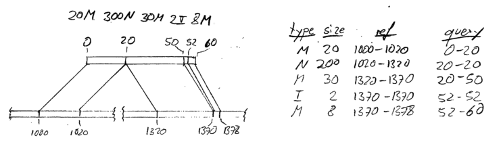

.. _counting:

**************
Counting reads
**************

.. currentmodule:: HTSeq

A very typical use case for the HTSeq library is to for a given list of genomic features (such as genes,
exons, ChIP-Seq peaks, or the like), how many sequencing reads overlap each of the features. As a more 
complex example for using HTSeq, we supply the script ``htseq-count``, which takes a GTF file with
gene models and a SAM file and counts for each gene how many reads map to it; see Section :ref:`count`.

The ``htseq-count`` script, however, has implementation details which were chosen with a specific use
case in mind, namely to quantify gene expression for subsequent testing for differential expression, 
which is why, for example, the script does not count reads that map to multiple genes. For other 
applications, different resolutions of such ambiguities might be desirable, and then, a bioinformatician
may want to create her own counting script. In the following, we expand on the coverage of this
topic in the *Tour* (:ref:`tour`) and give building blocks which should make it possible to write such scripts
also for bioinformaticians with only modest knowledge of Python.

Preparing the feature array
===========================

Our general approach is to define a :class:`GenomicArrayOfSets` and fill it with all the features we would
like to get counts for. 

Similar to the code shown in the *Tour*, we prepare such an object from the GTF file for yeast as follows::

   import HTSeq

   gtf_file = HTSeq.GFF_Reader( "Saccharomyces_cerevisiae.SGD1.01.56.gtf.gz" )
   exons = HTSeq.GenomicArrayOfSets( "auto", stranded=True )
   
   for feature in gtf_file:
       if feature.type == "exon":
          exons[ feature.iv ] += feature.attr["gene_id"]

A few things might be noteworthy here: For each exon, we just store the gene ID in the genomic array. Hence,
all exons from the same gene are represented with the same string. This is deliberate, as we want to count
on the level of genes, not exons, but could be done differently: storing the whole ``feature`` object in
the GenomicArrayOfSets uses up noticeably more memory but allows to access more information in downstream
processing.

Also note that in a GTF file, an exon that appears in several transcripts appear once for each 
transcripts. Because all these exons are represented by the same name, they will be collapsed to a single 
value in the GenomicArrayOfSets.

GTF files are not the only source of feature annotations. One could, as well, read a BED file or other 
text file with genomic coordinates of, say, ChIP-Seq peaks, putative enhancers, or any other kind of data.
For example, if we have a tab-separated text file with feature coordinates in four columns -- feature ID,
chromosome, start, end -- we might use::

   features =  HTSeq.GenomicArrayOfSets( "auto", stranded=False )
   for line in open( "myfeatures.txt" ):
      fields = line.split( "\t" )
      iv = HTSeq.GenomicInterval( fields[1], int(fields[2]), int(fields[3]) )
      features[ iv ] += fields[0]

Here, we have assumed that the coordinates follow Python conventions: The first base of a chromosome is 
numbered 0, not 1, and the end position is not included in the interval. Remember to subtract or add 1 as 
necessary if this is not the case with your input data.

Counting ungapped single-end reads
==================================

We start with the easiest case, that of ungapped single-end reads. We first recapitulate points
already shown in the *Tour* and then add further refinements in the following.

If we have a SAM file with unmapped reads, we might use the following code::

   import collections
   counts = collections.Counter( )

   almnt_file = HTSeq.SAM_Reader( "my_alignments.sam" )
   for almnt in almnt_file:
      if not almnt.aligned:
         count[ "_unmapped" ] += 1
         continue
      gene_ids = set()
      for iv, val in features[ almnt.iv ].steps():
         gene_ids |= val
      if len(gene_ids) == 1:
         gene_id = list(gene_ids)[0]
         counts[ gene_id ] += 1
      elif len(gene_ids) == 0:
         counts[ "_no_feature" ] += 1
      else:
         counts[ "_ambiguous" ] += 1

   for gene_id in counts:
      print gene_id, counts[ gene_id ]

For the benefit of readers with only limited Python knowledge, we go through this code chunk
step by step:

The variable ``counts`` contains a dictionary, which will associate gene IDs with read counts. We
use a variant of Python's usual ``dict`` type, namely the ``Counter`` class from the ``collections``
module in the standard library (from Python 2.7 onwards), which initialized any new key with 
the value zero. (Users of Python 2.6 can use ``collections.defaultdict(int)`` instead.)

We then instantiate a :class:`SAM_Reader`` object (If you have a BAM file, use ``BAM_Reader``
instead) and run through all its record in a ``for`` loop. As described in the Tour, each record 
in the SAM file is vprovided to the loop body in the variable ``almnt``. 

We first check whether the read might be unaligned, and if so, increment a special counter
that we call ``_unmapped`` (with an underscore as prefix to distinguish it from gene IDs).

For the aligned reads, the alignment's genomic interval, ``almnt.iv``, shows us the interval 
covered by the read. Using this as an index to ``feature`` gives us a view on this
stretch of the ``feature`` container, in which we had stored the exons. The iterator 
``features[ almnt.iv ].steps()`` returns pairs of the form ``(iv, val)``, where ``iv`` is
a genomic interval and ``val`` is the set of gene IDs associated with the exons overlapping 
this step. Using the ``|=`` operator, we get the union of the sets of all the steps in the
initially empty set ``gene_ids``, which, at the end, contains the gene IDs of all genes
that the read overlaps. Remember that a ``set`` can contain each element at most once. Hence,
even if we see the same gene in several steps (for example because the read overlaps with
several exons), we still get it only once in ``gene_ids``.

We then treat three possible cases, namely that the set ``gene_ids`` contains exactly one element,
that it is empty, or that it contains mroe than one element. The first case is the desired one:
The read overlaps with precisely one gene, and we hence increase the count for this gene by one.
Note that we need the idiom ``list(gene_ids)[0]`` to extract the name of this single gene from
the set. If the read did not overlap with a gene (``len(gene_ids) == 0``), we increase a special
counter that we call ``_no_feature``. 

What should we do if the read overlaps more than one gene? Here, one might now come up with 
sophisticated logic to decide which gene to count the read for. To keep things simple, however,
we simply count the read for none of the overlapped genes and instead increase the 
special counter ``_ambiguous`` .

In the final two lines, we loop through the counter to print out the counts.

Counting gapped single-end reads
================================

CIGAR Operations
----------------

The above code can be used as is e.g. for ChIP-Seq data, but for RNA-Seq data, we need an additional
ingredient: When sequencing RNA, many reads will pass over an exon-exon junction and hence align
to two (or more) disjunct intervals on the genome, tyically with an intron in between. If the reads
have been aligned with a splice-aware alignment tool, such gapped alignment is indicated in
the SAM file by the CIGAR string.

HTSeq parses the CIGAR string and presents it in the ``cigar`` slot of a class:`SAM_Alignment` object 
as a list of class:`CigarOperation` objects. As an example, consider a SAM alignment record
describing a read that has been aligned to position 1000 on the '+'' strand of chromosome ``chr1``, 
with CIGAR string ``20M300N30M2I8M``. Following the SAM specification (please read it first if 
you are unfamiliar with CIGAR strings), this means an alignment as depicted here:

[[TO DO: Nicer image, add "chr1:"]]

The ``SAM_Alignment`` object will hence have in its ``cigar`` slot a list of 5 objects, each giving the
information of one row of the table. Note how some operations are associated with zero-length intervals
on either the reference (i.e., chromosome) or the query (i.e., read). For example, the intron (``N200``)
spans 200 bp on the chromosome (1020-1320) but a zero-length interval on the read (20-20). In this manner,
the ``CigarOperation`` class conveniently shows which intervals are affected by which operation.

Counting with gapped reads
--------------------------

In the code above, we used this for loop ::

   gene_ids = set()
   for iv, val in features[ almnt.iv ].steps():
       gene_ids |= val

to collect the gene IDs of all exons overlapped by the reads interval. For loop runs over the whole 
interval covered by the aligned read, i.e., in the figure above, it would run from position 1000 
to position 1378 on chromosome 1, including the alignment gap from 1020 to 1320. By looking at each
cigar operation separately we can correctly skip the gaps. We only need to replace the for
loop with the following double loop ::

   gene_ids = set()
   for cigop in almnt.cigar:
      if cigop.type != "M":
         continue
      for iv, val in features[ cigop.ref_iv ].steps():
         gene_ids |= val

The outer loop goes through the CIGAR operation, skipping all but the *match* operations, and 
the inner loop inspects the steps covered by the match operations and collects the gene_ids in
the ``gene_ids`` set variable. The rest of the code stays as above.

Of course, custom logic can be implemented her to infer useful information from other cigar
operation types, but for the simple counting task at hand here, we do not need this.

Dealing with multiple alignments
--------------------------------

If the aligner finds multiple alignments for a read, these are typically reported in multiple
SAM records. If the SAM file unsorted or sorted by alignment position, it is hard to look at 
all the possible alignments of a given read together, because the records with the alignments
for a given read are spread throughout the file. If the purpose of the counting is subsequent
testing for differential expression, it is often safest, anyway, to skip all multiply
aligned reads (because a read that is counted for several genes may cause spurious calls of 
differential expression), and then, we merely need to recognize that a read has multiple
alignments. In the *htseq-count* script (see ref:`count`), this is done by two means:
First, many (but not all aligners) use the optional field "NH", which indicates the number
of reported alignments. Testing for ``almnt.optional_field("NH") > 1`` allows to find these
read. Also, if there are multiple good alignments, without one of them being considered by the
aligner to be more likely than the others, then the alignment quality (also denoted mapping quality,
MAPQ, in the SAM specification) should be 3 or less. Hence, if one skips all reads with an
alignment quality below, say, 10 (``almnt.aQual < 10``), one will skip over all multiply aligned
reads (provided the aligner indicates the mapping quality correctly, which is not always the case).

For more advanced use cases, it may be desirable to inspect all reported alignment, for example, to
the chose one using some custom logic, or to aggregate information over all of them. If the SAM
or BAM file has been sorted by *read name* then alternative alignments for the same read will
be in adjacent lines or records. To facilitate handling this case, HTSeq offers the function 
function:`bundle_multiple_alignments`. It takes an iterator over :class:`SAM_Alignment` objects
(e.g., a :class:`SAM_Reader` or :class:`BAM_Reader` object) and returns an iterator over 
lists of :class:`SAM_Alignment` objects. Each list contains only records describing alignments 
for the same read. For this to work, the SAM file has to be sorted by read name to ensure that
mutiple alignments for the same read appear in adjacent records.

Handling paired-end reads
-------------------------

In the case of paired-end alignments, we will typically want to count read pairs, not reads. After all,
the fragment (and not the reads from either of its ends) are the actual evidence for a gene's expression
that we want to count. Therefore, we want to process the alignment information for the two mated ends
together. 

First a quick review of how alignments for paired-end data are presented in a SAM file: The two "mated" reads referring to 
the two end of a DNA fragment are reported in two separate records. The fact that the records describe
the same fragment can be seen from the fact that they have the same read name (given by the ``read.name`` 
slot). That they refer to opposite ends can be seen from the respective bits in the FLAG field, which
are exposed by the :attr:`SAM_Alignment.pe_which` slot of the :class:`SAM_Alignment` class, which takes
the values ``first`` or ``second`` (or ``unknown`` if not specified in the flag field, or ``not_paired_end`` if
an alignment of a single-end read is represented) . If the read pair has multiple 
alignments, each alignment is reported by a pair of SAM records. As corresponding records are not necessarily
in adjacent lines, they are "linked" by the mate position fields (called RNEXT and PNEXT in the SAM specification),
which are exposed by the slot :attr:`SAM_Alignment.mate_pos`, which contains a :class:`GenomicPosition`
object. The two records describing the two halves of a given alignment can be recognized as being correspondent 
from the fact that each record's ``mate_pos`` attribute is equal to the starting position (given by``iv.start_as_pos``).

Note that all the SAM records for a given read pair may be spread throughout the file. Only if the file is sorted
by read name can we expect them to be at adjacent places, and even then, the records for multiple alignments can be
intermixed.

To facilitate handling paired-end alignments, HTSeq offers the function :func:`pair_SAM_alignments`. This function 
expects an iterator over SAM records (typically, a :class:`SAM_Reader` or :class:`BAM_Reader` object) and returns 
an iterator over pairs (i.e., tuples of length 2) of :class:`SAM_Alignment` records, with the first element being the alignment of the
read from the first sequencing pass (i.e., from the 5' end of the DNA fragment) and the second element the corresponding alignment 
from the second pass (i.e., the 3' read). The function expects the SAM file to be sorted by read name. It proceeds by reading
in consecutive records with the same read name and storing them in a list. Once it finds a record with a differing read name,
the function goes through the list, sorts its content into pairs of corresponding alignment records and yields these pairs. If the
function's option ``bundle``[TODO: add description of "bundle" in alignment.rst, too] is 
set to ``True``, the function does not yield the pairs separately but instead yields a list of all alignment pairs for
the same read.

Using these features, we can modify our counting loop as follows for paired-end data::

   almnt_file = HTSeq.SAM_Reader( "my_paired_alignments.sam" )
   counts = collections.Counter( )
   for bundle in HTSeq.pair_SAM_alignments( almnt_file, bundle=True ):
      if len(bundle) != 1
         continue  # Skip multiple alignments
      first_almnt, second_almnt = bundle[0]  # extract pair
      if not first_almnt.aligned and second_almnt.aligned:
         count[ "_unmapped" ] += 1
         continue
      gene_ids = set()
      for iv, val in features[ left_almnt.iv ].steps():
         gene_ids |= val
      for iv, val in features[ right_almnt.iv ].steps():
         gene_ids |= val
      if len(gene_ids) == 1:
         gene_id = list(gene_ids)[0]
         counts[ gene_id ] += 1
      elif len(gene_ids) == 0:
         counts[ "_no_feature" ] += 1
      else:
         counts[ "_ambiguous" ] += 1

   for gene_id in counts:
      print gene_id, counts[ gene_id ]

Note that here, we skip reads if only one of two mates are aligned. Of course, one could choose as well to count such a 
pair for the gene to which the aligned mate has been mapped.

The need to sort paired-end SAM files by read name can be an inconvenience, because many aligners output the SAM file
sorted by position. In many use case, we can expect that the two ends of the same read will align to positions close
to each other on the genome. Then, an alternative strategy to pair up alignment records is go through the SAM file, 
which has been sorted by position, and keep a dictionary of alignment records whose partner record has not been found yet.
For each record, we check the dictionary for its partner (i.e., for a record with the same read name and matching
position information). If we find the partner, we remove it from the dictionary and yield both together as a pair. If the partner
is not in the dictionary, the record is stored in the dictionary to wait for its partner to come along. As long as
mated records are not too far from each other in the file, the dictionary will only contain a manageable number of records.
Only if reads are often very far from each other (e.g., because the file was not sorted by position), the dictionary
might become too large to fit into memory. HTSeq offers this manner of pairing up alignment records in the function 
:func:`pair_SAM_alignment_with_buffer`, which can be used in the same manner as :func:`pair_SAM_alignment`, but
takes one optional additional argument, the maximum size of the buffer (by default, 3 million).