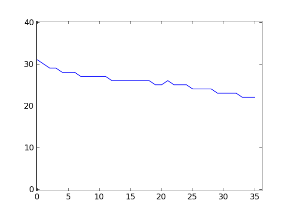

.. _tour:

********************
A tour through HTSeq
********************

.. currentmodule:: HTSeq

This tour demonstrates the
functionality of HTSeq by performing a number of common analysis tasks:

- Getting statistical summaries about the base-call quality scores to
  study the data quality.
- Calculating a coverage vector and exporting it for visualization in
  a genome browser.
- Reading in annotation data from a GFF file.
- Assigning aligned reads from an RNA-Seq experiments to exons and
  genes.

  
The following description assumes that the reader is familiar with Python and with HTS
data. (For a good and not too lengthy introduction to Python, read the `Python Tutorial`
on the Python web site.)

.. _`Python Tutorial`: http://docs.python.org/tutorial/
  
If you want to try out the examples on your own system, you can download the 
used example files here: `HTSeq_example_data.tgz`_

.. _HTSeq_example_data.tgz: http://www-huber.embl.de/users/anders/HTSeq/HTSeq_example_data.tgz

Reading in reads
================

In the example data, a FASTQ file is provided with example reads from a yeast RNA-Seq
experiment. The file ``yeast_RNASeq_excerpt_sequence.txt`` is an excerpt of the
``_sequence.txt`` file produced by the SolexaPipeline software. We can access it from
HTSeq with

::

   >>> import HTSeq
   >>> fastq_file = HTSeq.FastqReader( "yeast_RNASeq_excerpt_sequence.txt", "solexa" )
  
The first argument is the file name, the optional second argument indicates that 
the quality values are encoded according to Solexa's specification. If you omit it,
the default "phred" is assumed, which means the encoding originally suggested
by the Sanger Institute. (A third option is "solexa_old", for data from the SolexaPipeline
prior to version 1.3.)

The variable ``fastq_file`` is now an object of class :class:`FastqReader`, which
refers to the file::

   >>> fastq_file
   <FastqReader object, connected to file name 'yeast_RNASeq_excerpt_sequence.txt'>
  
When used in a ``for`` loop, it generates an iterator of objects representing the
reads. Here, we use the ``islice`` function from ``itertools`` to cut after 10
reads.

::

   >>> import itertools
   >>> for read in itertools.islice( fastq_file, 10 ):
   ...    print read
   CTTACGTTTTCTGTATCAATACTCGATTTATCATCT
   AATTGGTTTCCCCGCCGAGACCGTACACTACCAGCC
   TTTGGACTTGATTGTTGACGCTATCAAGGCTGCTGG
   ATCTCATATACAATGTCTATCCCAGAAACTCAAAAA
   AAAGTTCGAATTAGGCCGTCAACCAGCCAACACCAA
   GGAGCAAATTGCCAACAAGGAAAGGCAATATAACGA
   AGACAAGCTGCTGCTTCTGTTGTTCCATCTGCTTCC
   AAGAGGTTTGAGATCTTTGACCACCGTCTGGGCTGA
   GTCATCACTATCAGAGAAGGTAGAACATTGGAAGAT
   ACTTTTAAAGATTGGCCAAGAATTGGGGATTGAAGA
   
Of course, there is more to a read than its sequence. The variable ``read`` still
contains the tenth read, and we may examine it::

   >>> read
   <SequenceWithQualities object 'HWI-EAS225:1:10:1284:142#0/1'>

A :class:`Sequence` object has two slots, called :attr:`seq <Sequence.seq>` and 
:attr:`name <Sequence.name>`. This here is a :class:`SequenceWithQualities`, 
and it also has a slot :attr:`qual <SequenceWithQualities.qual>`::

   >>> read.name
   'HWI-EAS225:1:10:1284:142#0/1'
   >>> read.seq
   'ACTTTTAAAGATTGGCCAAGAATTGGGGATTGAAGA'
   >>> read.qual
   array([33, 33, 33, 33, 33, 33, 29, 27, 29, 32, 29, 30, 30, 21, 22, 25, 25,
          25, 23, 28, 24, 24, 29, 29, 29, 25, 28, 24, 24, 26, 25, 25, 24, 24,
          24, 24])

The values in the quality array are, for each base in the sequence, the Phred
score for the correctness of the base.

As a first simple example for the use of HTSeq, we now calculate the average
quality score for each position in the reads by adding up the ``qual`` arrays 
from all reads and the dividing by the number of reads. We sum everything up in
the variable ``qualsum``, a ``numpy`` array of integers::

   >>> import numpy
   >>> len( read )
   36
   >>> qualsum = numpy.zeros( len(read), numpy.int )

Then we loop through the fastq file, adding up the quality scores and
counting the reads::

   >>> nreads = 0
   >>> for read in fastq_file:
   ...    qualsum += read.qual
   ...    nreads += 1

The average qualities are hence::

   >>> qualsum / float(nreads)
   array([ 31.56838274,  30.08288332,  29.4375375 ,  29.00432017,
           28.55290212,  28.26825073,  28.46681867,  27.59082363,
           27.34097364,  27.57330293,  27.11784471,  27.19432777,
           26.84023361,  26.76267051,  26.44885795,  26.79135165,
           26.42901716,  26.49849994,  26.13604544,  25.95823833,
           25.54922197,  26.20460818,  25.42333693,  25.72298892,
           25.04164167,  24.75151006,  24.48561942,  24.27061082,
           24.10720429,  23.68026721,  23.52034081,  23.49437978,
           23.11076443,  22.5576223 ,  22.43549742,  22.62354494])

If you have `matplotlib`_ installed, you can plot this.

.. _matplotlib: http://matplotlib.sourceforge.net/

.. doctest::

   >>> from matplotlib import pyplot      
   >>> pyplot.plot( qualsum / nreads )    #doctest:+ELLIPSIS
   [<matplotlib.lines.Line2D object at 0x...>]
   >>> pyplot.show()                      #doctest:+SKIP 

This is a very simple way of looking at the quality scores. For more sophisticated 
quality-control techniques, see the Chapter :ref:`qa`.

What if you did not get the ``_sequence.txt`` file from your core facility but 
instead the ``export.txt`` file? While the former contains only the reads and
their quality, the latter also contains the alignment of the reads to a reference
as found by Eland. To read it, simply use

.. doctest::

   >>> alignment_file = HTSeq.SolexaExportReader( "yeast_RNASeq_excerpt_export.txt" )  #doctest:+SKIP
   
``HTSeq`` can also use other alignment formats, e.g., SAM::   
   
   >>> alignment_file = HTSeq.SAM_Reader( "yeast_RNASeq_excerpt.sam" )
   
If we are only interested in the qualities, we can rewrite the commands from above
to use the ``alignment_file``::

   >>> nreads = 0
   >>> for aln in alignment_file:
   ...    qualsum += aln.read.qual
   ...    nreads += 1

We have simple replaced the :class:`FastqReader` with a :class:`SolexaExportReader`, which 
iterates, when used in a ``for`` loop, over :class:`SolexaExportAlignment` objects. Each of
these contain a field :attr:`read <Alignment.read>` that contains the :class:`SequenceWithQualities`
object, as before. There are more parses, for example the :class:`SAM_Reader` that can read SAM
files, and generates :class:`SAM_Alignment` objects. As all :class:`Alignment` objects
contain a :attr:`read <Alignment.read>` slot with the :class:`SequenceWithQualities`, we can use the same
code with any alignment file for which a parser has been provided, and all we have
to change is the name of the reader class in the first line.

The other fields that all :class:`Alignment` objects contain, is a Boolean called 
:attr:`aligned <Alignment.aligned>` that tells us whether the read has been aligned 
at all, and a field called :attr:`iv <Alignment.iv>`
(for "interval") that shows where the read was aligned to. We use this information in
the next section.

Genomic intervals and genomic arrays
====================================

Genomic intervals
-----------------

At the end of the previous section, we looped through a SAM file. In the for loop,
the :class:`SAM_Reader` object yields for each alignment line in the SAM file an
object of class :class:`SAM_Alignment`. Let's have closer look at such an object,
still found in the variable ``aln``:

.. doctest::

   >>> aln
   <SAM_Alignment object: Read 'HWI-EAS225:1:11:76:63#0/1' aligned to IV:[246048,246084)/+>
   
Every alignment object has a slot ``read``, that contains a :class:`SequenceWithQualities` object as
described above

.. doctest::

   >>> aln.read
   <SequenceWithQualities object 'HWI-EAS225:1:11:76:63#0/1'>
   >>> aln.read.name
   'HWI-EAS225:1:11:76:63#0/1'
   >>> aln.read.seq
   'ACTGTAAATACTTTTCAGAAGAGATTTGTAGAATCC'
   >>> aln.read.qual
   array([33, 33, 33, 33, 31, 33, 30, 32, 33, 30, 29, 33, 32, 32, 32, 31, 32,
          31, 29, 28, 30, 28, 30, 24, 28, 30, 28, 26, 24, 29, 24, 23, 23, 27,
          25, 25])

Furthermore, every alignment object has a slot ``iv`` (for "interval") that describes where
the read was aligned to (if it was aligned). To hold this 
information, an object of class :class:`GenomicInterval`
is used that has slots as follows:

.. doctest::

   >>> aln.iv
   <GenomicInterval object 'IV', [246048,246084), strand '+'>
   >>> aln.iv.chrom
   'IV'
   >>> aln.iv.start
   246048
   >>> aln.iv.end
   246084
   >>> aln.iv.strand
   '+'

Note that all coordinates in HTSeq are zero-based (following Python convention), i.e.
the first base of a chromosome has index 0. Also, all intervals are half-open, i.e.,
the ``end`` position is not included. The strand can be one of ``'+'``, ``'-'``, 
and ``'.'``, where the latter indicates that the strand is not defined or not of interest. 

Apart from these slots, 
a :class:`GenomicInterval` object has a number of convenience functions, see the reference. 

Note that a SAM file may contain reads that could not be aligned. For these, the
`iv` slot contains `None`. To test whether an alignment is present, you can also
query the slot `aligned`, which is a Boolean.

Genomic Arrays
--------------

The :class:`GenomicArray` data structure is a convenient way to store and
retrieve information associated with a genomic position or genomic interval. In
a GenomicArray, data (either simple scalar data like a number) or can be stored
at a place identified by a GenomicInterval. We demonstrate with a toy example.

Assume you have a genome with three chromosomes with the following lengths (in bp):

.. doctest::

   >>> chromlens = { 'chr1': 3000, 'chr2': 2000, 'chr1': 1000 }

We wish to store integer data (typecode "i")

.. doctest:: 

   >>> ga = HTSeq.GenomicArray( chromlens, stranded=False, typecode="i" )

Now, we can assign the value 5 to an interval:

.. doctest:: 

   >>> iv = HTSeq.GenomicInterval( "chr1", 100, 120, "." )
   >>> ga[iv] = 5
   
We may want to add the value 3 to an interval overlapping with the previous one:

   >>> iv = HTSeq.GenomicInterval( "chr1", 110, 135, "." )
   >>> ga[iv] += 3

.. doctest:: 

To see the effect of this, we read out an interval encompassing the region that 
we changed. To display the data, we convert to a list:
   
.. doctest:: 
   
   >>> iv = HTSeq.GenomicInterval( "chr1", 90, 140, "." )
   >>> list( ga[iv] )  #doctest: +NORMALIZE_WHITESPACE   
   [0, 0, 0, 0, 0, 0, 0, 0, 0, 0, 5, 5, 5, 5, 5, 5, 5, 5, 5, 5, 8, 8, 8, 
    8, 8, 8, 8, 8, 8, 8, 3, 3, 3, 3, 3, 3, 3, 3, 3, 3, 3, 3, 3, 3, 3, 0, 
    0, 0, 0, 0]
   
It would be wasteful to store all these repeats of the same value as it
is displayed here. Hence, GenomicArray objects use by default so-called
StepVectors that store the data internally in "steps" of constant value. 
Often, reading out the data that way is useful, too:

.. doctest:: 

   >>> for iv2, value in ga[iv].steps():
   ...    print iv2, value
   ... 
   chr1:[90,100)/. 0
   chr1:[100,110)/. 5
   chr1:[110,120)/. 8
   chr1:[120,135)/. 3
   chr1:[135,140)/. 0

If the steps become very small, storing them instead of just the unrolled data may
become inefficient. In this case, GenomicArrays should be instantiated with
storage mode ``ndarray`` to get a normal numpy array as backend, or with storage
mode ``memmap`` to use a file/memory-mapped numpy array (see reference for details).

In the following section, we demonstrate how a GenomicArray can be used to 
calculate a coverage vector. In the section after that, we see how a GenomicArray
with type code 'O' (which stands for 'object', i.e., any kind of data, not just 
numbers) is useful to organize metadata.

Calculating coverage vectors
============================

By a "coverage vector", we mean a vector (one-dimensional array) of the length of
a chromosome, where each element counts how many reads cover the corresponding
base pair in their alignment. A GenomicArray can conveniently bundle the
coverage vectors for all the chromosomes in a genome.

Hence, we start by defining a :class:`GenomicArray`:

   >>> cvg = HTSeq.GenomicArray( "auto", stranded=True, typecode='i' )
   
Instead of listing all chromosomes, we instruct the GenomicArray to add chromosome
vectors as needed, by specifiyng ``"auto"``. As we set ``stranded=True``, there are now two 
chromosome vectors for each
chromosome, all holding integer values (``typecode='i'``). They all have an
"infinte" length as we did not specify the actual lengths of the chromosomes.

To build the coverage vectors, we now simply iterate
through all the reads and add the value 1 at the interval to which each read was aligned
to::

   >>> alignment_file = HTSeq.SAM_Reader( "yeast_RNASeq_excerpt.sam" )
   >>> cvg = HTSeq.GenomicArray( "auto", stranded=True, typecode='i' )
   >>> for alngt in alignment_file:
   ...    if alngt.aligned:
   ...       cvg[ alngt.iv ] += 1

We can plot an excerpt of this with:   

.. doctest::

   >>> pyplot.plot( list( cvg[ HTSeq.GenomicInterval( "III", 200000, 500000, "+" ) ] ) )     #doctest:+ELLIPSIS
   [<matplotlib.lines.Line2D object at 0x...>]
   
However, a proper genome browser gives a better impression of the data. The following commands
write two BedGraph (Wiggle) files, one for the plus and one for the minus strands::

   >>> cvg.write_bedgraph_file( "plus.wig", "+" )
   >>> cvg.write_bedgraph_file( "minus.wig", "-" )
   
These two files can then be viewed in a genome browser (e.g. IGB_), alongside the 
annotation from a GFF file (see below).

.. _IGB: http://igb.bioviz.org/  
 
 
Counting reads by genes
=======================

As the example data is from an RNA-Seq experiment, we want to know how many reads fall into
the exonic regions of each gene. For this purpose we first need to read in information about the
positions of the exons. A convenient source of such information are the GTF files from 
Ensembl_ (to be found here_).

.. _Ensembl: http://www.ensembl.org/index.html
.. _here: ftp://ftp.ensembl.org/pub/current_gtf/

These file are in the `GTF format`_, a tightening of the `GFF format`_. HTSeq offers the
:class:`GFF_Reader` class to read in a GFF file:

.. _`GTF format`: http://mblab.wustl.edu/GTF22.html
.. _`GFF format`: http://www.sanger.ac.uk/resources/software/gff/spec.html

   >>> gtf_file = HTSeq.GFF_Reader( "Saccharomyces_cerevisiae.SGD1.01.56.gtf.gz" )
   >>> for feature in itertools.islice( gtf_file, 10 ):
   ...    print feature
   ... 
   <GenomicFeature: exon 'R0010W' at 2-micron: 251 -> 1523 (strand '+')>
   <GenomicFeature: CDS 'R0010W' at 2-micron: 251 -> 1520 (strand '+')>
   <GenomicFeature: start_codon 'R0010W' at 2-micron: 251 -> 254 (strand '+')>
   <GenomicFeature: stop_codon 'R0010W' at 2-micron: 1520 -> 1523 (strand '+')>
   <GenomicFeature: exon 'R0020C' at 2-micron: 3007 -> 1887 (strand '-')>
   <GenomicFeature: CDS 'R0020C' at 2-micron: 3007 -> 1890 (strand '-')>
   <GenomicFeature: start_codon 'R0020C' at 2-micron: 3007 -> 3006 (strand '-')>
   <GenomicFeature: stop_codon 'R0020C' at 2-micron: 1888 -> 1887 (strand '-')>
   <GenomicFeature: exon 'R0030W' at 2-micron: 3270 -> 3816 (strand '+')>
   <GenomicFeature: CDS 'R0030W' at 2-micron: 3270 -> 3813 (strand '+')>

The ``feature`` variable is filled with objects of class :class:`GenomicFeature`. 
As with all Python objects, the **dir** function shows us its slots and functions:

.. doctest::

   >>> dir( feature )   #doctest:+NORMALIZE_WHITESPACE,+ELLIPSIS
   ['__class__', ..., '__weakref__', 'attr', 'frame', 'get_gff_line', 
   'iv', 'name', 'score', 'source', 'type']
   
Ignoring the attributes starting with an underscore, we can see now how to access 
the information stored in the GFF file. The information from the columns of the GFF
table is accessible as follows::

   >>> feature.iv
   <GenomicInterval object '2-micron', [3270,3813), strand '+'>
   >>> feature.source
   'protein_coding'
   >>> feature.type
   'CDS'
   >>> feature.score
   '.'

The last column (the attributes) is parsed and presented as a dict:

.. doctest::

   >>> feature.attr    #doctest:+NORMALIZE_WHITESPACE
   {'exon_number': '1', 'gene_id': 'R0030W', 'transcript_name': 'RAF1', 
   'transcript_id': 'R0030W', 'protein_id': 'R0030W', 'gene_name': 'RAF1'}
   
The very first attribute in this column is usually some kind of ID, hence it is
stored in the slot :attr:`name <GenomicFeature.name>`:

   >>> feature.name
   'R0030W'

To deal with this data, we will use a :class:`GenomicArray`. A GenomicArray can store 
not only numerical data but also arbitrary Python objects (with `typecode` `'O'`).
Hence, we can assign those features that correspond to exons, to steps in the GenomicArray::

   >>> exons = HTSeq.GenomicArray( "auto", stranded=False, typecode='O' )
   >>> for feature in gtf_file:
   ...    if feature.type == "exon":
   ...       exons[ feature.iv ] = feature

Now, we can ask what exons occur in a certain interval::

   >>> iv = HTSeq.GenomicInterval( "II", 120000, 125000, "." )
   >>> list( exons[iv].steps() ) #doctest:+NORMALIZE_WHITESPACE
   [(<GenomicInterval object 'II', [120000,121877), strand '.'>, 
         <GenomicFeature: exon 'YBL052C' at II: 121876 -> 119382 (strand '-')>),
    (<GenomicInterval object 'II', [121877,122755), strand '.'>, 
         None),
    (<GenomicInterval object 'II', [122755,124762), strand '.'>,
         <GenomicFeature: exon 'YBL051C' at II: 124761 -> 122756 (strand '-')>),
    (<GenomicInterval object 'II', [124762,125000), strand '.'>, 
         None)]

However, our RNA-Seq experiment was not strand-specific, i.e., we do not know whether
the reads came from the plus or the minus strand. This is why we defined the GenomicArray
as non-stranded (``stranded=False`` in the instantiation of ``exons`` above), instructing
it to ignore all strand information. An issue with this is that we now have many overlapping
genes and the simple assignment ``exons[ feature.iv ] = feature`` is overwriting, so that
it is not clear which feature we set.

The proper solution is to store not just single features at an interval but sets of all
features which are present there. A specialization of :class:`GenomicArray`, 
:class:`GenomicArrayOfSets` is offered to simplify this::

   >>> exons = HTSeq.GenomicArrayOfSets( "auto", stranded=False )

We populate the array again with the feature data. This time, we use the 
``+=``, which, for a GenomicArrayOfSets, does not mean numerical addition,
but adds an object without overwriting what might already be there. Instead,
it uses sets to deal with overlaps. (Also, we only store the gene name this time, as this
will be more convenient later).
 
   >>> for feature in gtf_file:
   ...    if feature.type == "exon":
   ...       exons[ feature.iv ] += feature.name

Assume we have a read covering this interval::

   >>> iv = HTSeq.GenomicInterval( "III", 23850, 23950, "." )

Its left half covers two genes (YCL058C, YCL058W-A), but its right half only
YCL058C because YCL058W-A end in the middle of the read::

   >>> list( exons[iv].steps() )   #doctest:+NORMALIZE_WHITESPACE
   [(<GenomicInterval object 'III', [23850,23925), strand '.'>,
        set(['YCL058C', 'YCL058W-A'])),
    (<GenomicInterval object 'III', [23925,23950), strand '.'>, 
        set(['YCL058C']))]

Assuming the transcription boundaries in our GTF file to be correct, we may conclude
that this read is from the gene that appears in both steps and not from the one that
appears in only one of the steps. More generally, whenever a read overlaps multiple 
steps (a new step starts wherever a feature starts or ends), we get a set of feature
names for each step, and we have to find the intersection of all these. This can be
coded as follows::

   >>> intersection_set = None
   >>> for iv2, step_set in exons[iv].steps():
   ...    if intersection_set is None:
   ...       intersection_set = step_set.copy()
   ...    else:
   ...       intersection_set.intersection_update( step_set )
   ... 
   >>> print intersection_set
   set(['YCL058C'])

When we look at the first step, we make a
copy of the steps (in order to not disturb the values stored in ``exons``.) For the following
steps, we use the **intersection_update**
method Python's standard **set** class, which performs a set intersection in 
place. Afterwards, we have a set with precisely one element. Getting this one 
element is a tiny bit cumbersome; to access it, one needs to write::

   >>> list(intersection_set)[0]
   'YCL058C'

In this way, we can go through all our aligned reads, calculate the intersection
set, and, if it contains a single gene name, add a count for this gene. For the
counters, we use a dict, which we initialize with a zero for each gene name::

   >>> counts = {}
   >>> for feature in gtf_file:
   ...    if feature.type == "exon":
   ...       counts[ feature.name ] = 0

Now, we can finally count::

   >>> sam_file = HTSeq.SAM_Reader( "yeast_RNASeq_excerpt.sam" )
   >>> for alnmt in sam_file:
   ...    if alnmt.aligned:
   ...       intersection_set = None
   ...       for iv2, step_set in exons[ alnmt.iv ].steps():
   ...           if intersection_set is None:
   ...              intersection_set = step_set.copy()
   ...           else:
   ...              intersection_set.intersection_update( step_set )
   ...       if len( intersection_set ) == 1:
   ...          counts[ list(intersection_set)[0] ] += 1

We can now conveniently print the result with:

.. doctest::

   >>> for name in sorted( counts.keys() ):  
   ...    print name, counts[name]   #doctest:+ELLIPSIS
   15S_rRNA 0
   21S_rRNA 0
   HRA1 0
   ...
   YPR048W 2
   YPR049C 3
   YPR050C 0
   YPR051W 1
   YPR052C 1
   YPR053C 5
   YPR054W 0
   ...
   tY(GUA)M2 0
   tY(GUA)O 0
   tY(GUA)Q 0
   
Some aligners can output gapped or spliced alignments. In a SAM file, this in encoded
in the CIGAR string. HTSeq has facilities to handle this conveniently, too, with the
class :class:`CigarOperation`. Chapter :ref:`count` describes a script which offers
some further counting schemes.

Mapping structural variants to genes
====================================

If we have performed SNP- or SV-calling on our dataset and end up with a set of structural variations (e.g. snps and indels) we might want to map those to genes to see which genes are potentially influenced by them.

Using the previously described :class:`GFF_Reader` we get the :class:`GenomicArray` of exons that we're interested in.

    >>> exons = HTSeq.GenomicArray( "auto", stranded=False, typecode='O' )
    >>> for feature in gtf_file:
    ...     if feature.type == "exon":
    ...         exons[ feature.iv ] = feature

If our variant calls are in a `VCF`_-file we can use the :class:`VCF_Reader` to extract the :class:`VariantCall` objects describing our snps and indels and start mapping them to our genes.

    .. _`VCF`: http://www.1000genomes.org/wiki/Analysis/Variant%20Call%20Format/vcf-variant-call-format-version-40
 
    >>> vcfr = HTSeq.VCF_Reader( "00-All.vcf.gz" )
    >>> vcfr.parse_meta()
    >>> vcfr.make_info_dict()
    >>> for vc in vcfr:
    ...     print list( exons[vc.pos] )

And much more
=============   
      
This tour was only meant to give an overview. There are many more tasks that can
be solved with HTSeq. Have a look at the reference documentation in the following pages
to see what else is there.      
