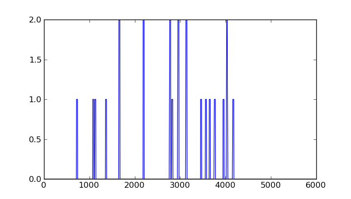
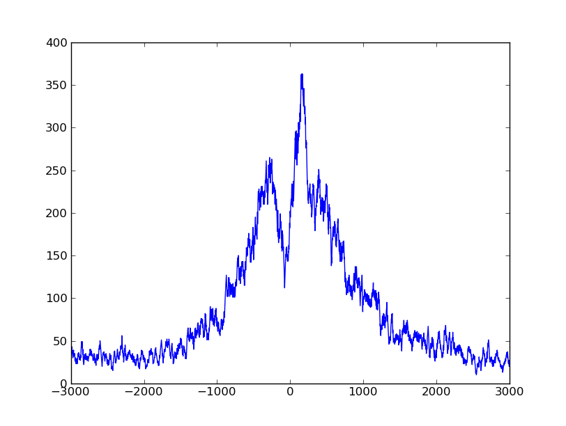
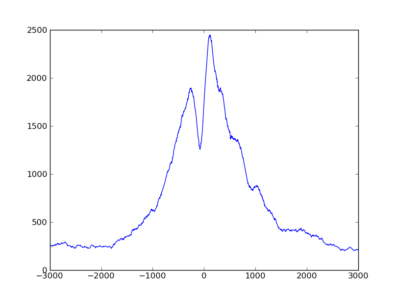
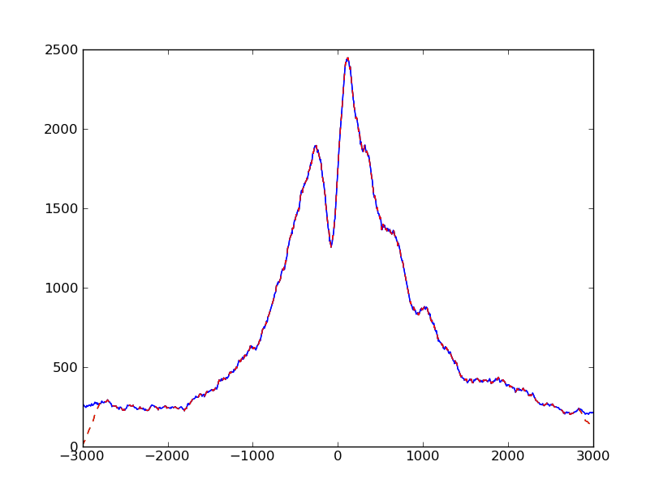

.. _tss:

******************************
A detailed use case: TSS plots
******************************

.. currentmodule:: HTSeq

A common task in ChIP-Seq analysis is to get profiles of marks with respect to
nearby features. For example, when analysing histone marks, one is often interested
in the position and extend of such marks in the vicinity of transcription start
sites (TSSs). To this end, one commonly calculates the coverage of reads or fragments
across the whole genome, then marks out fixed-size windows centered  around the 
TSSs of all genes, takes the coverages in these windows and adds them up to a
"profile" that has the size of the window. This is a simple operation, which, however,
can become challenging, when working with large genomes and very many reads. 

Here,
we demonstrate various ways of how data flow can be organized in HTSeq by means of
different solutions to this task.

As example data, we use a short excerpt from
the data set by Barski et al. (Cell, 2007, 129:823). We downloaded the FASTQ file
for one of the H3K4me3 samples (Short Read Archive accession number SRR001432),
aligned it against the Homo sapiens genome build GRCh37 with BWA, and provide the 
start of this file (actually only containing reads aligned to chromosome 1) as
file ``SRR001432_head.bam`` with the HTSeq example files. As annotation, we use
the file ``Homo_sapiens.GRCh37.56_chrom1.gtf``, which is the part of the Ensembl
GTF file for Homo sapiens for chromosome 1.

Using the full coverage
-----------------------

We start with the straight-forward way of calculating the full coverage first
and then summing up the profile. This can be done as described in the :ref:`Tour <tour>`::

   >>> import HTSeq
   >>> bamfile = HTSeq.BAM_Reader( "SRR001432_head.bam" )
   >>> gtffile = HTSeq.GFF_Reader( "Homo_sapiens.GRCh37.56_chrom1.gtf" )
   >>> coverage = HTSeq.GenomicArray( "auto", stranded=False, typecode="i" )
   >>> for almnt in bamfile:
   ...    if almnt.aligned:
   ...       coverage[ almnt.iv ] += 1

To find the location of all transcription start sites, we can look in the GTF
file for exons with exon number 1 (as indicated by the ``exon_number``
attribute in Ensembl GTF files) and ask for their directional start (``start_d``).
The following loop extracts and prints this information (using ``itertools.islice``
to go through only the first 100 features in the GTF file)::

   >>> import itertools
   >>> for feature in itertools.islice( gtffile, 100):
   ...    if feature.type == "exon" and feature.attr["exon_number"] == "1":
   ...       print feature.attr["gene_id"], feature.attr["transcript_id"], feature.iv.start_d_as_pos
   ENSG00000223972 ENST00000456328 1:11873/+
   ENSG00000223972 ENST00000450305 1:12009/+
   ENSG00000227232 ENST00000423562 1:29369/-
   ENSG00000227232 ENST00000438504 1:29369/-
   ENSG00000227232 ENST00000488147 1:29569/-
   ENSG00000227232 ENST00000430492 1:29342/-
   ENSG00000243485 ENST00000473358 1:29553/+
   ENSG00000243485 ENST00000469289 1:30266/+
   ENSG00000221311 ENST00000408384 1:30365/+
   ENSG00000237613 ENST00000417324 1:36080/-
   ENSG00000237613 ENST00000461467 1:36072/-
   ENSG00000233004 ENST00000421949 1:53048/+
   ENSG00000240361 ENST00000492842 1:62947/+
   ENSG00000177693 ENST00000326183 1:69054/+

As the GTF file contains several transcripts for each gene, one TSS may appear 
multiple times, giving undue weight to it. Hence, we collect them in a ``set``
as this data type enforces uniqueness.

   >>> tsspos = set()
   >>> for feature in gtffile:
   ...    if feature.type == "exon" and feature.attr["exon_number"] == "1":
   ...       tsspos.add( feature.iv.start_d_as_pos )

Let's take one of these starting positions. To get a nice one, we manually chose
this one here, just for demonstration purposes::

   >>> p = HTSeq.GenomicPosition( "1", 145439814, "+" )

This is really one of the TSSs in the set:

   >>> p in tsspos
   True

We can get a window centered on this TSS by just subtracting and adding a fixed
value (half of the desired window size, let's use 3 kb)::
   
   >>> halfwinwidth = 3000
   >>> window = HTSeq.GenomicInterval( p.chrom, p.pos - halfwinwidth, p.pos + halfwinwidth, "." )
   >>> window
   <GenomicInterval object '1', [145436814,145442814), strand '.'>

We can check the coverage in this window by subsetting and transforming to a list:

.. doctest::

   >>> list( coverage[window] )  #doctest: +ELLIPSIS
   [0, 0, 0, ..., 0, 0]

As we will work with numpy_ from now on, it may be better to get this as 
numpy array:

.. _numpy: http://numpy.scipy.org/

.. doctest::

   >>> import numpy
   >>> wincvg = numpy.fromiter( coverage[window], dtype='i', count=2*halfwinwidth )
   >>> wincvg
   array([0, 0, 0, ..., 0, 0, 0], dtype=int32)

With matplotlib, we can see that this vector is, in effect, not all zero:

.. doctest::

   >>> from matplotlib import pyplot
   >>> pyplot.plot( wincvg )    #doctest: +SKIP
   >>> pyplot.show()            #doctest: +SKIP

To sum up the profile, we initialize a numpy vector of the size of our window with zeroes::

   >>> profile = numpy.zeros( 2*halfwinwidth, dtype='i' )

Now, we can go through the TSS positions and add the coverage in their windows 
to get the profile::

   >>> for p in tsspos:
   ...    window = HTSeq.GenomicInterval( p.chrom, p.pos - halfwinwidth, p.pos + halfwinwidth, "." )
   ...    wincvg = numpy.fromiter( coverage[window], dtype='i', count=2*halfwinwidth )
   ...    if p.strand == "+":
   ...       profile += wincvg
   ...    else:
   ...       profile += wincvg[::-1]

Note that we add the window coverage reversed ("``[::-1]``") if the gene was on the minus
strand.

Using matplotlib, we can plot this:

.. doctest::

   >>> pyplot.plot( numpy.arange( -halfwinwidth, halfwinwidth ), profile )  #doctest: +SKIP
   >>> pyplot.show()  #doctest: +SKIP

We can see clearly that the reads concentrate around the TSS, with a prominent peak 
a bit downstream (if you use matplotlib's interactive zoom, you can easily see that
the peak is at 153 bp) and a dip upstream, at -79 bp.

Going back to the beginning, there is one possible improvement: When calculating the
coverage, we just added one to all the base pairs that the read covered. However, the
fragment extends beyond the read, to a length of about 200 bp (the fragment size for
which Barski et al. selected). Maybe we get a better picture by calculating
the coverage not from the reads but from the *fragments*, i.e., the reads extended
to fragment size. For this, we just one
line, to extend the read to 200 bp. Using this, we now put the whole script together:

.. literalinclude:: tss1.py 

The script produces a ``profile`` variable whhich we can plot by adding these lines
to it:

.. doctest::

   pyplot.plot( numpy.arange( -halfwinwidth, halfwinwidth ), profile )  #doctest: +SKIP
   pyplot.show()  #doctest: +SKIP

The plot looks much smoother with the extended fragments.

The coverage vector can be held in memory, even for a very large genome, because large
parts of it are zero and even where there are reads, the values tend to stay constant 
for stretches of several bases. Hence, GenomicArray's step storage mode is useful.
If, however, extremely large amounts of reads are processed, the coverage vector can become "rough" and
change value at every position. Then, the step storage mode becomes inefficient
and we might be better off with an ordinary dense vector such as provided by numpy.
As this numpy vector becomes very large, it may not fit in memory, and the 'memmap'
storage (using numpy's memmap facility) then uses temporary files on disk. We
mention these possibilities as they may be useful when working with the full coverage vector
is required. Here, however, we can do otherwise.

Using indexed BAM files
-----------------------

We do not need the coverage everythere. We only need it close to the TSSs. We can
sort our BAM file by position (``samtools sort``) and index it (``samtools index``)
and then use random access, as HTSeq exposes this functionality of SAMtools. 

Let's say we use the same window as above as example::

   >>> p = HTSeq.GenomicPosition( "1", 145439814, "+" )
   >>> window = HTSeq.GenomicInterval( p.chrom, p.pos - halfwinwidth, p.pos + halfwinwidth, "." )
   >>> window
   <GenomicInterval object '1', [145436814,145442814), strand '.'>
   
Then, we can simply get a list of all reads within this interval as follows:

.. doctest::

   >>> sortedbamfile = HTSeq.BAM_Reader( "SRR001432_head_sorted.bam" )
   >>> for almnt in sortedbamfile[ window ]:
   ...     print almnt   #doctest:+ELLIPSIS +NORMALIZE_WHITESPACE
   <SAM_Alignment object: Paired-end Read 'SRR001432.90270 USI-EAS21_0008_3445:8:3:245:279 length=25' aligned to 1:[145437532,145437557)/->
    ...
   <SAM_Alignment object: Paired-end Read 'SRR001432.205754 USI-EAS21_0008_3445:8:5:217:355 length=25' aligned to 1:[145440975,145441000)/->
      
Let's have a closer look at the last alignment. As before, we first extent the read to fragment size::

   >>> fragmentsize = 200
   >>> almnt.iv.length = fragmentsize
   >>> almnt
   <SAM_Alignment object: Paired-end Read 'SRR001432.205754 USI-EAS21_0008_3445:8:5:217:355 length=25' aligned to 1:[145440800,145441000)/->
   
The read has been aligned to the "-"
strand, and hence, we should look at its distance to the *end* of the window
(i.e., ``p.pos``, the position of the TSS, plus half the window width)
to see where it should be added to the ``profile`` vector::

   >>> start_in_window = p.pos + halfwinwidth - almnt.iv.end
   >>> end_in_window   = p.pos + halfwinwidth - almnt.iv.start
   >>> print start_in_window, end_in_window
   1814 2014

To account for this read, we should add ones in the profile vector along
the indicated interval.
   
Using this, we can go through the set of all TSS positions (in the ``tsspos``
set variable that we created above) and for each TSS position, loop through
all aligned reads close to it. Here is this double loop::

   >>> profileB = numpy.zeros( 2*halfwinwidth, dtype='i' )   
   ... for p in tsspos:
   ...    window = HTSeq.GenomicInterval( p.chrom, p.pos - halfwinwidth, p.pos + halfwinwidth, "." )
   ...    for almnt in sortedbamfile[ window ]:
   ...       almnt.iv.length = fragmentsize
   ...       if p.strand == "+":
   ...          start_in_window = almnt.iv.start - p.pos + halfwinwidth 
   ...          end_in_window   = almnt.iv.end   - p.pos + halfwinwidth 
   ...       else:
   ...          start_in_window = p.pos + halfwinwidth - almnt.iv.end
   ...          end_in_window   = p.pos + halfwinwidth - almnt.iv.start
   ...       profileB[ start_in_window : end_in_window ] += 1

This loop now runs a good deal faster than our first attempt, and has a much
smaller memory footprint.

We can plot the profiles obtained from our two methods on top of each other:

.. doctest::

   >>> pyplot.plot( numpy.arange( -halfwinwidth, halfwinwidth ), profile, ls="-", color="blue" )   #doctest: +SKIP
   >>> pyplot.plot( numpy.arange( -halfwinwidth, halfwinwidth ), profileB, ls="--", color="red" )   #doctest: +SKIP
   >>> pyplot.show()   #doctest: +SKIP

We notice that they are equal, except for the boundaries. This artifact arose
because we extend reads to fragment length: A read which is just outside 
the ``window`` will not be found by our new loop even though if may reach into our
profile window after extension to fragment length. Therefore, we should make the
window used to subset the BAM file a bit wider than before to get even reads that
are once the fragment length away. However, with this, we may also get reads that
get extended into the wrong direction, such that ``start_in_windows`` and 
``end_in_windows`` extend beyond the size of the fragment vector. Four extra lines
need to be added to deal with these cases, and then, our new script gives the 
same result as the previous one. 

Here is the complete code:

.. literalinclude:: tss2.py 

As before, to get a plot, add:

.. doctest::

   pyplot.plot( numpy.arange( -halfwinwidth, halfwinwidth ), profile )   #doctest: +SKIP
   pyplot.show()   #doctest: +SKIP

You will now get the same plot as we got with the first method.
   
Streaming through all reads
---------------------------

The previous solution requires sorting and indexing the BAM file. For large amounts
of data, this may be a burden, and hence, we show a third solution that does not
require random access to reads. The idea is to go through all reads in arbitrary
order, check for each read whether it falls into one or more windows around TSSs,
and, if so, adds ones to the profile vector at the appriate places. In essence, it
is the same tactic as before, but nesting the two *for* loops the other way round.

In order to be able to check quickly whether a read overlaps with a window, we
can use a :class:`GenomicArrayOfSets`, in which we mark off all windows. For
easy access, we denote each winow with an :class:`GenomicPosition` object
giving its midpoint, i.e., the actual TSS position, as follows::

   >>> tssarray = HTSeq.GenomicArrayOfSets( "auto", stranded=False )
   >>> for feature in gtffile:
   ...    if feature.type == "exon" and feature.attr["exon_number"] == "1":
   ...       p = feature.iv.start_d_as_pos
   ...       window = HTSeq.GenomicInterval( p.chrom, p.pos - halfwinwidth, p.pos + halfwinwidth, "." )
   ...       tssarray[ window ] += p

   >>> len( list( tssarray.chrom_vectors["1"]["."].steps() ) )
   30085

As before, ``p`` is the position of the TSS, and ``window`` is the interval 
around it. 

To demonstrate how this data structure can be used, we take a specific read that 
we selected as a good example::

   >>> for almnt in bamfile:
   ...     if almnt.read.name.startswith( "SRR001432.700 " ):
   ...         break
   >>> almnt
   <SAM_Alignment object: Paired-end Read 'SRR001432.700 USI-EAS21_0008_3445:8:1:35:294 length=25' aligned to 1:[169677855,169677880)/->

Again, we extent the read to fragment size::

   >>> almnt.iv.length = fragmentsize
   >>> almnt
   <SAM_Alignment object: Paired-end Read 'SRR001432.700 USI-EAS21_0008_3445:8:1:35:294 length=25' aligned to 1:[169677680,169677880)/->
   
To see which windows the read covers, we subset the ``tssarray`` and ask for steps
that the fragment in ``almnt`` covers:

   >>> for step_iv, step_set in tssarray[ almnt.iv ].steps():
   ...    print "Step", step_iv, ", contained by these windows:"
   ...    for p in step_set:
   ...        print "   Window around TSS at", p
   Step 1:[169677680,169677838)/. , contained by these windows:
      Window around TSS at 1:169677780/-
      Window around TSS at 1:169679672/-
   Step 1:[169677838,169677880)/. , contained by these windows:
      Window around TSS at 1:169680838/-
      Window around TSS at 1:169679672/-
      Window around TSS at 1:169677780/-

As is typical for GenomicArrayOfSets, some TSSs appear in more than one step. To make
sure that we don't count them twice, we take the union of all the step sets (with 
the operator ``|=``, which means in-place union when used for Python sets):
  
.. doctest::  
  
   >>> s = set()
   >>> for step_iv, step_set in tssarray[ almnt.iv ].steps():
   ...    s |= step_set
   >>> s  ##doctest:+NORMALIZE_WHITESPACE
   set([<GenomicPosition object '1':169680838, strand '-'>, 
        <GenomicPosition object '1':169677780, strand '-'>, 
        <GenomicPosition object '1':169679672, strand '-'>])
  
For each of the values for ``p`` in ``s``, we calculate values for ``start_in_window`` 
and ``stop_in_window``, as before, and then add ones in the ``profile`` vector
at the appropriate places. 

Putting all this together leads to this script:
   
.. literalinclude:: tss3.py
   
Again, to get a plot (which will look the same as before), add:

.. doctest::

   pyplot.plot( numpy.arange( -halfwinwidth, halfwinwidth ), profile )  #doctest: +SKIP
   pyplot.show()  #doctest: +SKIP
   
